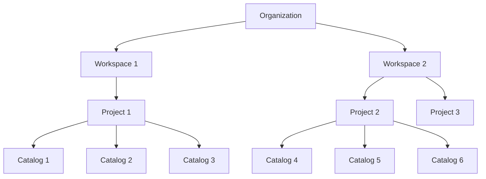

import { Diagram } from 'mdx-deck'

# Peaka API Architecture Overview

Peaka provides a structured environment for managing data integrations and analytics. Understanding the hierarchy and relationships between its core components is essential for effective utilization.

## 🔹 Organization

- **Definition**: The top-level entity representing a business or team within Peaka.
- **Role**: Serves as the container for all workspaces, projects, and associated resources.
- **API Endpoint**: `GET /organizations` to list all organizations.

## 🔹 Workspace

- **Definition**: A collaborative environment within an organization where teams can manage projects.
- **Role**: Facilitates team collaboration and resource management within an organization.
- **API Endpoint**: `GET /organizations/{organizationId}/workspaces` to list workspaces within an organization.

## 🔹 Project

- **Definition**: A unit within a workspace where data connections are established and workflows are executed. This is the core component of Peaka. Projects are isolated from other projects within the same workspace. You can create **Project Api Key**s to enable access to only this project without access to other projects.
- **Role**: Central unit for data operations, including queries, tables, and integrations.
- **API Endpoint**: `POST /organizations/{organizationId}/workspaces/{workspaceId}/projects` to create a new project.

## 🔹 Connection

- **Definition**: A configuration that links a project to external data sources, such as databases or APIs, including necessary credentials.
- **Role**: Enables data ingestion and synchronization from various external systems.
- **API Endpoint**: `POST /projects/{projectId}/connections` to establish a new connection.
- **Note**: A single connection can be used to create multiple catalogs, allowing for the reuse of credentials across different data sources.

## 🔹 Catalog

- **Definition**: A structured representation of data schemas and tables associated with a connection.
- **Role**: Provides metadata and structure for querying and analyzing data.
- **API Endpoint**: `POST /projects/{projectId}/catalogs` to create a catalog using a connection.
- **Note**: Multiple catalogs can be created from a single connection, each representing different naming of same external source.

